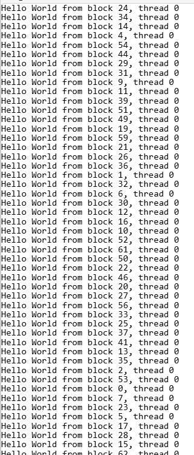
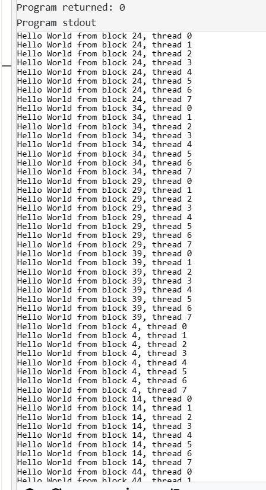
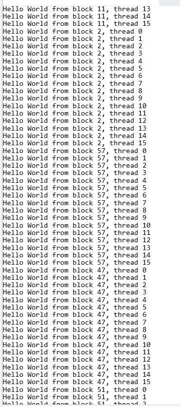
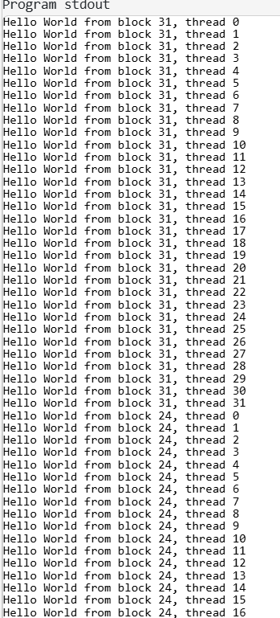
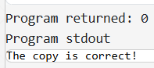
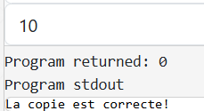

# TP1 - Introduction to CUDA Programming
**Mathieu WAHARTE - 17/03/2026**

## Exercice 1 - Hello World
Pour un blocSize de 1 et 64 blocks on a :  

Pour un blockSize de 8 et 64 blocks on a :

Pour un blockSize de 16 et 64 blocks on a :

Pour un blockSize de 64 et 64 blocks on a :

On peut voir que les threads sont regroupés par block, et que les threads d'un même block ont des threadIdx allant de 0 à blockSize-1. Les blocks sont numérotés de 0 à numBlocks-1.  

&nbsp;  
## Exercice 2 - CPU/GPU memory transfer using CUDA
1) static copy:

2) dynamic copy:

&nbsp;  
## Exercice 3 - Writing a GPU-GPU memcpy kernel
On utilise a nouveaux `cudaMemcpy` (with `cudaMemcpyHostToDevice` and `cudaMemcpyDeviceToHost`), `cudaMalloc` et `cudaFree` pour allouer et libérer la mémoire sur le GPU, et pour copier les données entre les tableaux sur le GPU. 
Les ids corrects sont `idx = blockIdx.x * blockDim.x + threadIdx.x;`

&nbsp;  
## Exercice 4 - CUDA saxpy kernel
In this exercise, you will write a saxpy BLAS kernel that performs thte operation y = ax + y for vectors x, y of size N
and the scalar a. You will write multiple kernels that perform this operation:
a) First, a kernel that only launches blocks, and one thread per block, each block working on one vector element
b) Another kernel that uses a certain number of threads (multiple of 32) per block, each thread working on one
vector element
c) Finally, a kernel that uses a certain number of threads per block, each thread working on K elements of the
vector.
In doing these operations, you should also perform necessary memory copies at appropriate places as indicated in the
provided skeleton code saxpy.cu.

&nbsp;  
## Exercice 5 - CUDA convolution kernel
In this exercise, you will write a simple 1D convolution kernel that performs the operation y[i] = (x[i −1] + x[i] +
x[i + 1])/3.0 for vectors x, y of size N and for all 1 ≤i < N (and set y[0] = x[0], y[N −1] = x[N −1]). You will write
multiple kernels that perform this operation:
a) First, a kernel that only launches blocks, and one thread per block, each block working on one vector element
b) Another kernel that uses a certain number of threads (multiple of 32) per block, each thread working on one
vector element
c) Finally, a kernel that uses a certain number of threads per block, each thread working on K elements of the
vector, where K is a compile-time constant/macro (e.g., #define K 8)
In doing these operations, you should also perform necessary memory copies at appropriate places as indicated in the
provided skeleton code convolution.cu.